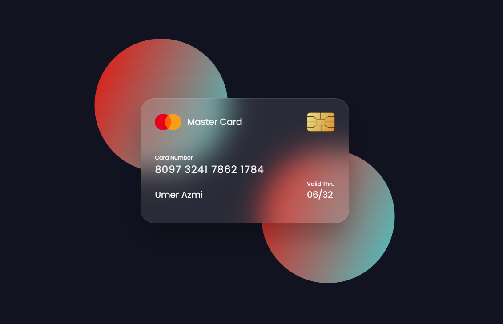

# Flipping Credit Card UI

An interactive credit card component built using HTML and CSS that simulates a real-world card with a smooth 3D flip animation on hover.

## Preview

  

## Features

* Realistic credit card front and back design
* Smooth 3D flip animation using CSS transforms
* Glassmorphism-style card appearance
* Gradient background with decorative elements
* Card details including number, holder name, and validity date
* Magnetic strip and signature panel on back side
* Centered responsive layout

## Technologies Used

* HTML5
* CSS3 (Flexbox, transforms, transitions, backdrop filter)
* Google Fonts (Poppins)

## Purpose

This project was created to practice advanced CSS techniques including 3D transforms, perspective, layered elements, and modern UI styling.

## How to Run

1. Download or clone the project.
2. Open `index.html` in any modern web browser.

---

Interactive UI component demonstrating animation, visual depth, and modern frontend styling techniques.
