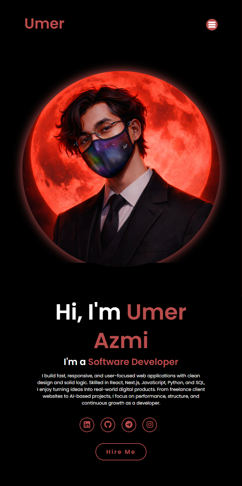

# Personal Portfolio Landing Page

A responsive personal portfolio landing page built using HTML, CSS, and JavaScript, featuring a modern hero section, mobile navigation, social links, and animated typing text.

## Preview

  

  <strong>Desktop Preview</strong> 
  

  <strong>Mobile Preview</strong> 
  

## Features

* Fully responsive layout for mobile and desktop
* Sliding mobile navigation menu
* Modern hero section with personal branding
* Animated typing text effect using CSS
* Social media links with hover animations
* Call-to-action button
* Clean dark theme design

## Technologies Used

* HTML5
* CSS3 (Flexbox, media queries, animations, transitions)
* JavaScript (menu toggle functionality)
* Google Fonts (Poppins)
* Font Awesome icons

## Purpose

This project was created to practice building a modern personal portfolio interface, responsive layouts, navigation behavior, and interactive UI elements.

## How to Run

1. Download or clone the project.
2. Open `index.html` in any modern web browser.

---

Responsive portfolio UI demonstrating real-world frontend design and layout techniques.
