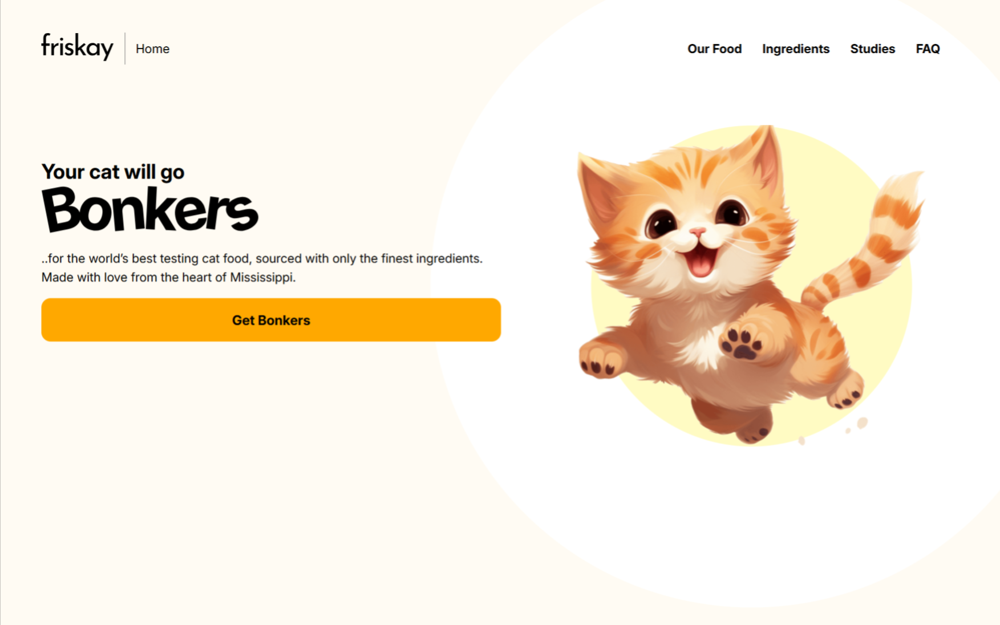

# Responsive Landing Page UI

A modern responsive landing page built using HTML, CSS, and JavaScript, featuring a mobile navigation menu, hero section, and call-to-action layout.

## Preview

  

  #### Mobile Preview

  

  #### Desktop Preview

  

## Features

* Fully responsive layout for mobile and desktop
* Sliding mobile navigation menu
* Clean hero section with headline and CTA
* Modern typography using Google Fonts
* Decorative illustration with layered shapes
* Flexbox-based layout
* Smooth transitions and interactions

## Technologies Used

* HTML5
* CSS3 (Flexbox, media queries, transitions)
* JavaScript (menu toggle functionality)
* Google Fonts (Inter)

## Purpose

This project was created to practice building responsive website layouts, mobile navigation patterns, and modern landing page design techniques.

## How to Run

1. Download or clone the project.
2. Open `index.html` in any modern web browser.

---

Responsive UI example demonstrating layout design, navigation behavior, and real-world landing page structure.
